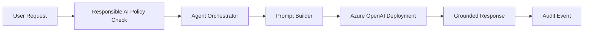

# Azure AI Foundry Agent Starter

An enterprise-ready starter project showing how an Azure AI Foundry-style agent can orchestrate user intent, policy checks, prompt construction, and Azure OpenAI calls.

## Why This Project Matters

This project is designed for roles involving:

- Microsoft Azure AI Foundry
- Azure OpenAI
- AI agents
- Prompt engineering
- Responsible AI guardrails
- Secure enterprise AI implementation

## Architecture



## Features

- Agent orchestration structure
- Azure OpenAI configuration via environment variables
- Prompt template separation
- Input risk screening
- Audit-friendly response metadata
- Unit tests for policy behavior

## Quick Start

```powershell
python -m venv .venv
. .venv/Scripts/Activate.ps1
pip install -e ".[dev]"
copy .env.example .env
pytest
```

## Environment Variables

```text
AZURE_OPENAI_ENDPOINT=https://your-resource.openai.azure.com/
AZURE_OPENAI_API_KEY=replace-me
AZURE_OPENAI_DEPLOYMENT=gpt-4o-mini
```

## Portfolio Talking Point

This project demonstrates how I structure enterprise AI agents with explicit policy checks, environment-based configuration, prompt management, and testable orchestration.

